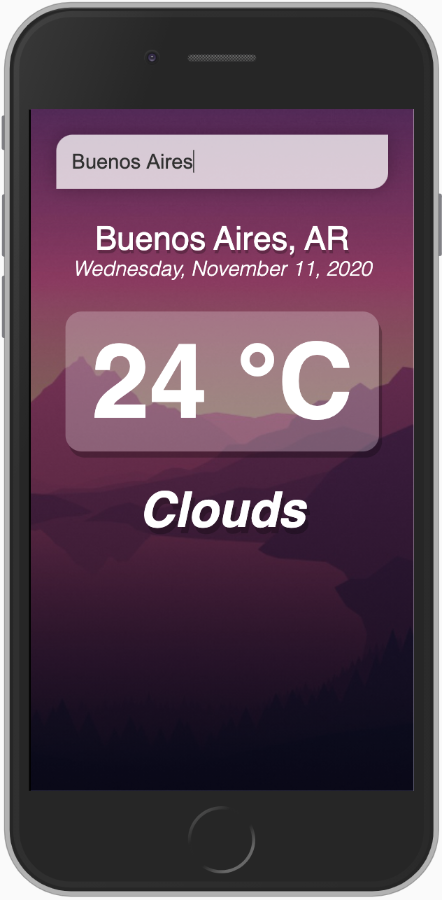

# Weather App / VueJs
Weather app that consumes [OpenWeatherMap](https://openweathermap.org/) API



## Tree
```
.
├── public
└── src
    └── assets
```
## Project setup
Copy the env-example file and fill it with your credentials `cp env-example .env`.

```
yarn install
```

### Compiles and hot-reloads for development
```
yarn serve
```

### Compiles and minifies for production
```
yarn build
```

### Lints and fixes files
```
yarn lint
```